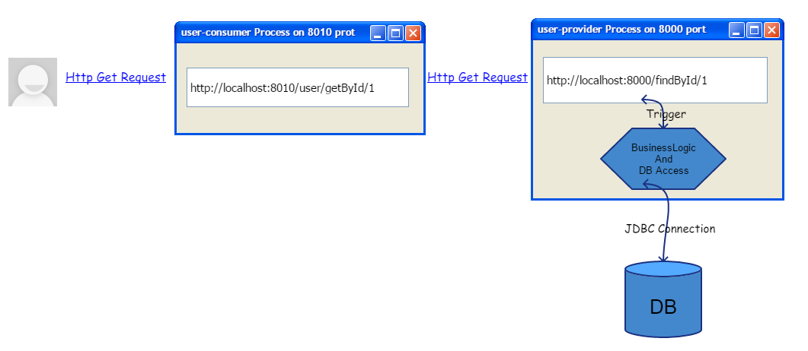

# Microservice(微服務)
* 微服務是一種將大型系統分割成各個微小服務的概念，分割可能以模組功能或模組職責來劃分。
* 例如login動作可以分為登入、認證、援權以及側寫等等，其中登入因為依賴認證、援權以及側寫等微服務，所以登入這個微服務稱服務消費者，其它三個微服務稱服務提供者
* 對前端客戶而言，它們只需要認得登入這個微服務即可，其它依賴的服務在後端會自動串起來。

下圖我們用服務消費者及服務提供者的觀念，來存取一張稱為User的資料表，圖中的user-consumer即服務消費者，而user-provider是服務提供者:

這張圖的架構我們以***[Part1_User_consumer_simple](../Part1_User_consumer_simple/)***及***[Part1_User_provider_simple](../Part1_User_provider_simple/)***這兩個project之程式碼來實作，程式碼中皆有豐富且詳細的註解。

啟動這兩個專案後，可以得到上圖中的user-consumer process及user-provider process，當然每一個process你都可以多開，只要把/Part1_User_consumer_simple/src/main/resources/application.yml及//Part1_User_provider_simple/src/main/resources/application.yml這兩個設定檔中的port號改掉即可。

由上架構可知，這樣雖然也算微服務，但是這是一個很低級的架構，整個微服務的clustering完全沒有人監控，整個系統毫無HA、tolerance、以及load balanced制度。