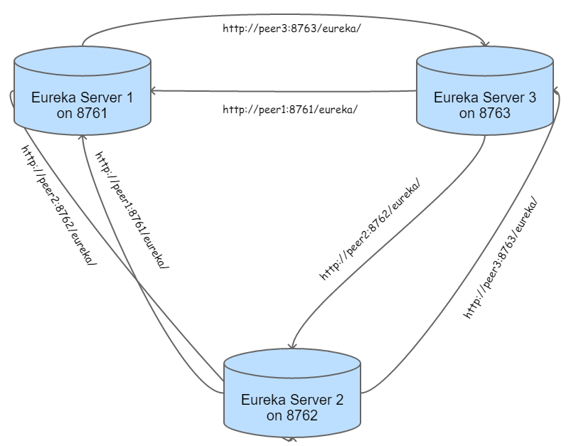
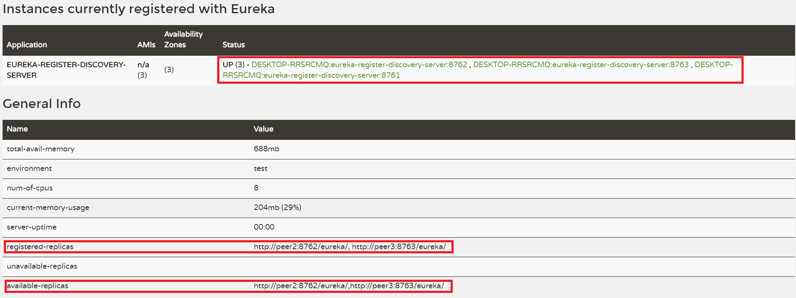
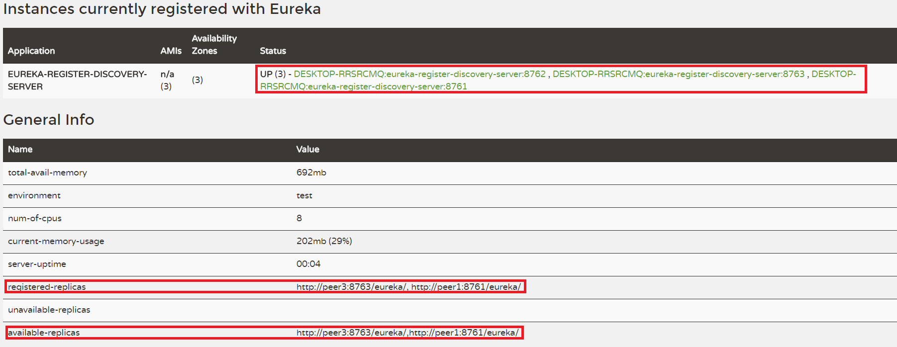
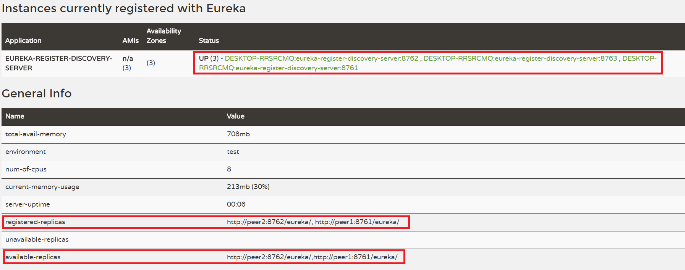

# Eureka Server(微服務的註冊及監管之伺服器)
* 微服務註冊表：Eureka Server會保存一份系統叢集中所有微服務的註冊名單。
* 微服務註冊：當每一個微服務啟動時，它們就是Eureka Client，它們會向Eureka Server註冊自己這個服務。
* 微服務發現：是指可以向Eureka Server查詢所有微服務以及它們各自的instance(Process)之資訊的功能。
* 微服務檢查：Eureka Server每隔一段時間會檢查系統叢集中的各微服務狀態，如果某個微服務之instance(Process)長期無法訪問(Heart beat fail)時，它會從自己的服務列表中移除該instance(Process)。
* 微服務伺服器的HA：可以開啟多台Eureka Server，它們相互的定期sync對方的微服務註冊表，所以若當中一台Eureka Server當機，所有微服務會自動轉向另一台Eureka Server。

下圖為我們導入Eureka Server後，整個叢集式Eureka Server的HA之觀念：

這張圖的架構我們以***[Part2_Eureka_Server](../Part2_Eureka_Server/)***這個project之程式碼來實作，程式碼中皆有豐富且詳細的註解。

啟動三次這個專案後(port number須不同)，可以得到上圖中的eureka-server process1、eureka-server process2及eureka-server process3，而且他們正在相互的sync且互為備援。如下：

1.此圖為eureka-server process1，訪問 http://localhost:8761/ (8761為第一台Eureka Server)

2.此圖為eureka-server process2，訪問 http://localhost:8762/ (8762為第二台Eureka Server)

3.此圖為eureka-server process3，訪問 http://localhost:8763/ (8763為第三台Eureka Server)

由上三張圖可知，除了三台Eureka Server相互註冊之外，系統中完全沒有其它的微服務正在運作，接下來的***[Part2_User_consumer](../Part2_User_consumer/)***及***[Part2_User_provider](../Part2_User_provider/)***這兩個project，我們將會把微服務消費者及微服務提供者導進來，使它們能註冊在各台Eureka Server中。