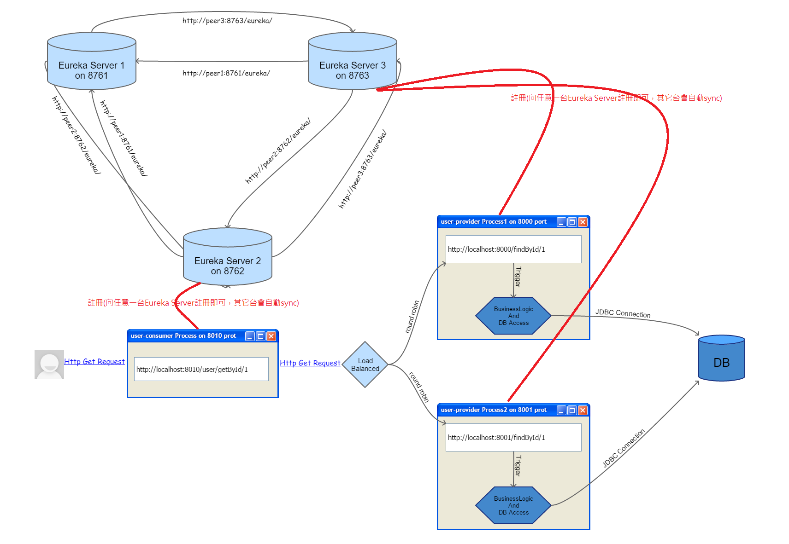
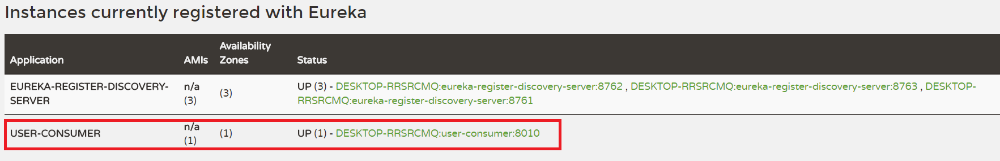

# user-consumer Service(註冊服務消費者及使用負載平衡的方式呼叫各個服務提供者)
* 註冊微服務消費者：宣告自己是一個Eureka Client並且向Eureka Server提出註冊。
* 負載平衡：使用Ribbon改造微服務消費者使用負載平衡方式來向微服務提供者做請求(Round robbin,Response weight,Random,...)。

下圖為我們導入Eureka Server及請求服務的負載平衡後，整個微服務的架構：

這張圖的架構我們以***[Part2_Eureka_Server](../Part2_Eureka_Server/)***、***[Part2_User_consumer](../Part2_User_consumer/)***及***[Part2_User_provider](../Part2_User_provider/)***這三個project之程式碼來實作，程式碼中皆有豐富且詳細的註解。

啟動這個專案及***[Part2_Eureka_Server](../Part2_Eureka_Server/)***專案後，隨便進入任何一台Eureka Server首頁(例如:http://localhost:8761) 。如下圖示：

由上圖可知，我們已經成功讓user-consumer這個Micro-Service Process交由Eureka Server來註冊管理了。至於微服務消費者對微服務提供者的load balanced策略，我們到***[Part2_User_provider](../Part2_User_provider/)***專案再進行Demo。