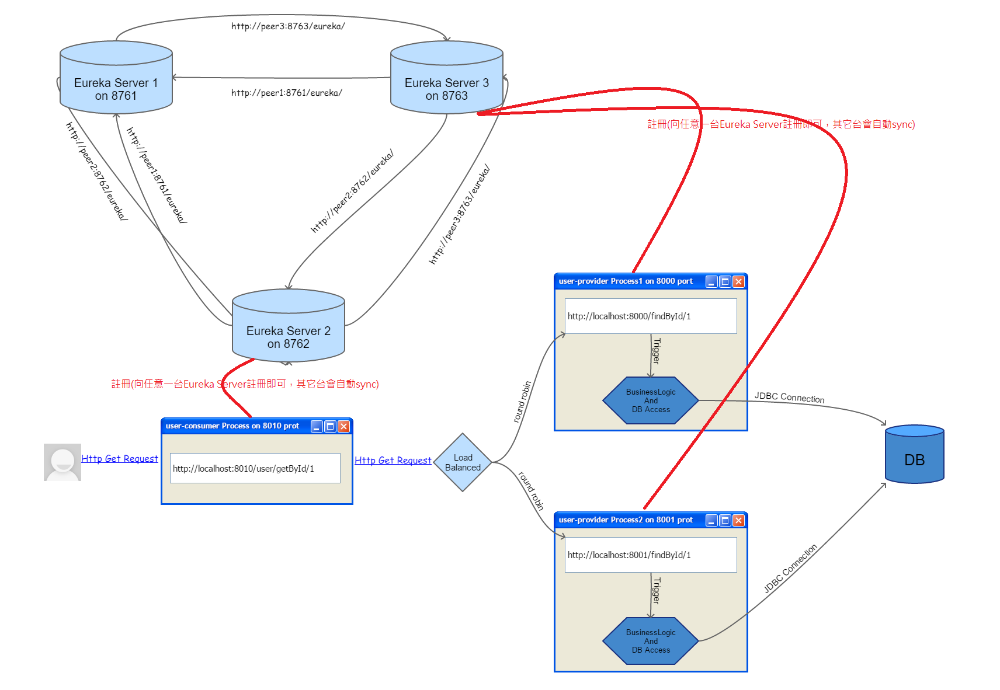
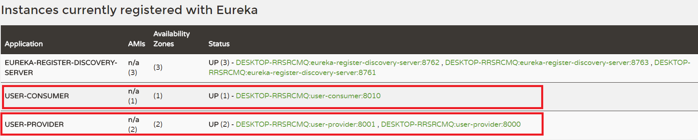
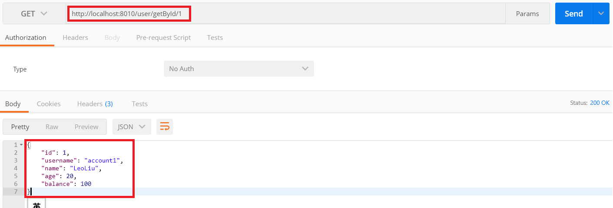
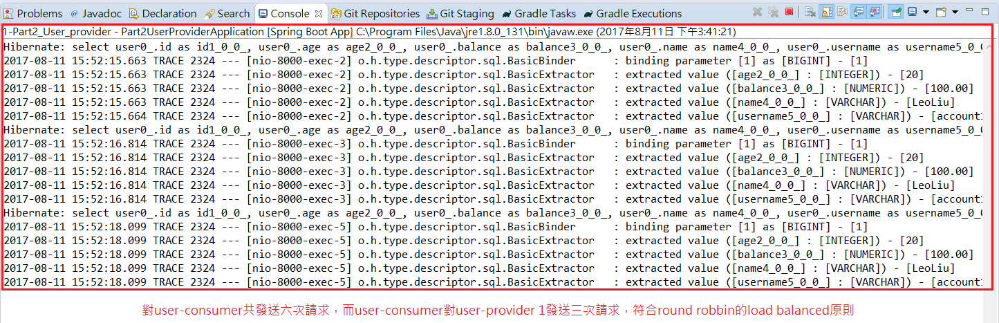
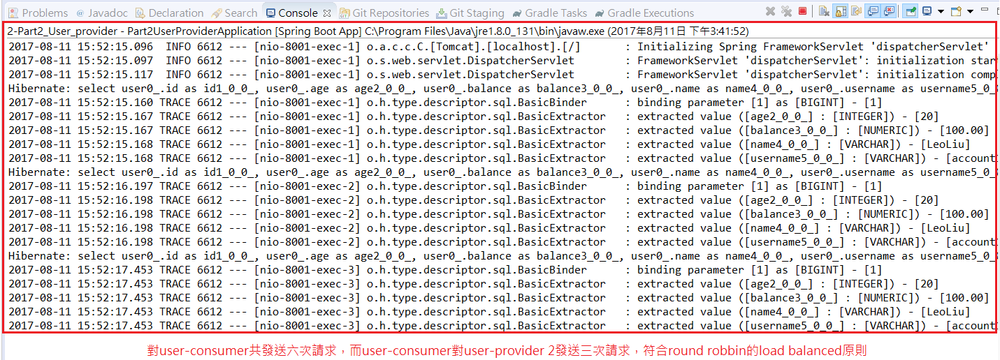

# user-provider Service(註冊服務提供者)
* 註冊微服務提供者：宣告自己是一個Eureka Client並且向Eureka Server提出註冊。
* 其它部份完全不需要更動即可。

下圖為我們導入Eureka Server及請求服務的負載平衡後，整個微服務的架構：(同***[Part2_User_consumer](../Part2_User_consumer/)***)

這張圖的架構我們以***[Part2_Eureka_Server](../Part2_Eureka_Server/)***、***[Part2_User_consumer](../Part2_User_consumer/)***及***[Part2_User_provider](../Part2_User_provider/)***這三個project之程式碼來實作，程式碼中皆有豐富且詳細的註解。

啟動***[Part2_Eureka_Server](../Part2_Eureka_Server/)***和***[Part2_User_consumer](../Part2_User_consumer/)***這兩個專案後，再啟動這個專案兩次(port number須不同)，我們要製造兩個微服務提供者來測試load balanced，皆啟動成功後，再隨便進入任何一台Eureka Server首頁(例如:http://localhost:8761) 。如下圖示：

由上圖可知，我們已經成功讓user-consumer及兩個user-provider之Micro-Service Processes交由Eureka Server來註冊管理。

最後我們利用Google Chrome的postman plugin來測試這個架構的負載平衡，看看user-consumer是否會平均的向兩個user-provider發送請求(因為我們使用的策略是round robbin)。我們用postman這個client端總共對user-consumer發送六次請求，結果如下圖示：

因為我們六次請求都呼叫同一個服務方法，所以當然會得到一樣的結果，接著回去看看eclipse中的console：

user-provider 1的console如下圖示：

user-provider 2的console如下圖示：

由上兩圖可知，我們一共對user-consumer發送六次請求，而user-consumer對user-provider 1及user-provider 2分別各發送三次請求(Console中各顯示出三句Hibernate Select Sql)，符合round robbin的load balanced原則。

以上架構已具備雲端微服務分散式叢集的基礎了，但是tolerance(容錯能力)尚未考量，我們即將在下一個部份***[Part3_User_consumer_feign](../Part3_User_consumer_feign/)***做討論。