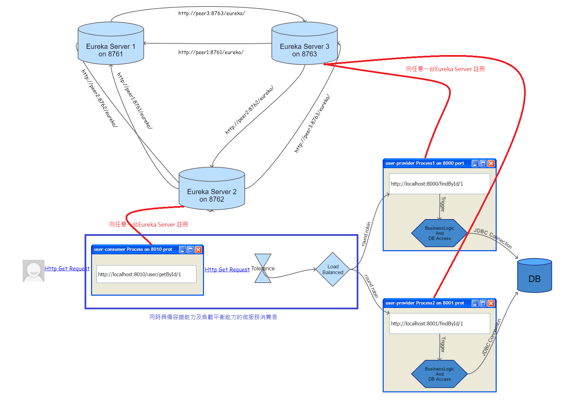
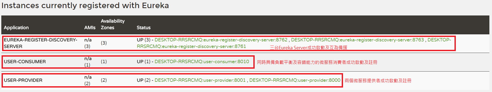
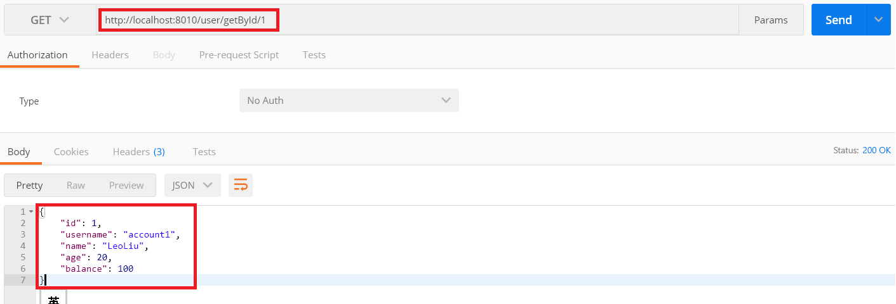
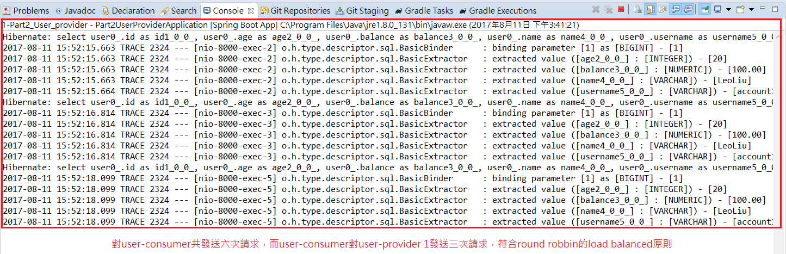
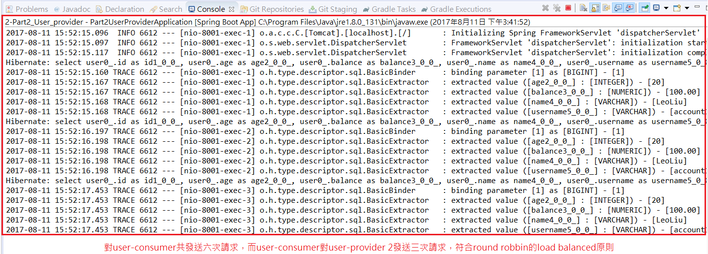
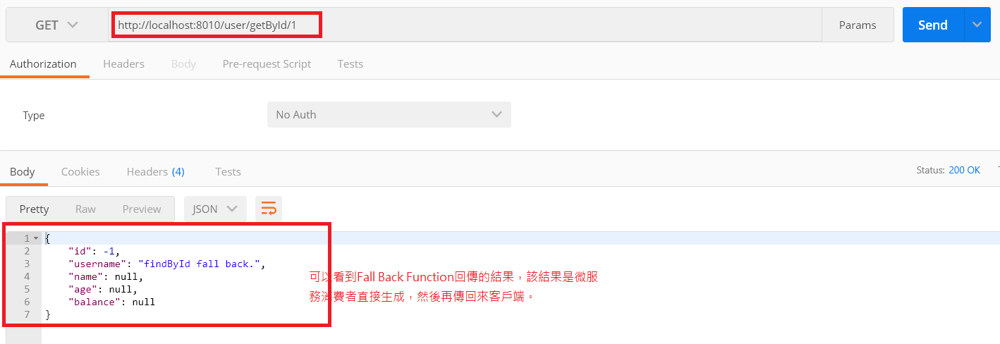

# user-consumer Service(具備tolerance能力的微服務消費者)
* 註冊微服務消費者：宣告自己是一個Eureka Client並且向Eureka Server提出註冊。
* 負載平衡：改用Feign達到load balanced。
* 容錯能力：開啟Hystrix達到tolerance。

## Tolerance(何謂容錯能力)
當某一個微服務不可用時，若客戶端還一直送request請求過來，只會造成更多懸掛著的處理，進而形成整個系統的當機，此謂雪崩效應。
因此一個好的容錯設計需滿足以下：
* 當某個服務被請求時的錯誤失敗機率過高，應該立刻停止該服務的請求通道(斷路)。
* 每個微服務都有一個執行緒池，若請求進來的執行緒已超過該執行緒池所能容納的量時，應該立即拒絕讓請求，而不是排隊等待。
* 必須能監控微服務被請求時的成功、失敗、超時、以及被拒絕的次數。
* 當請求因容錯能力而被拒絕的情況下，必須提供請求失敗的另一個選擇路徑，而不是直接告知失敗訊息。
* 當某個微服務因為容錯能力而被切斷請求通道時，過一段時間必須把通道偶發打開，放一些請求過去，藉以測試該微服務是否恢復正常，若失敗則繼續斷路，若成功則完全打開通道，以實現系統的自我修復能力。

下圖為我們導入Hystrix容錯之後，整個微服務的架構：(本部份只有微服務消費者有變化，在load balanced之前實現容錯能力，其它如Eureka、微服務提供者等，皆無變化)

這張圖的架構我們以***[Part2_Eureka_Server](../Part2_Eureka_Server/)***、***[Part3_User_consumer_feign](../Part3_User_consumer_feign/)***及***[Part2_User_provider](../Part2_User_provider/)***這三個project之程式碼來實作，程式碼中皆有豐富且詳細的註解。

啟動***[Part2_Eureka_Server](../Part2_Eureka_Server/)***以及***[Part2_User_provider](../Part2_User_provider/)***這兩個專案後，再啟動這個專案，之後隨便進入任何一台Eureka Server首頁(例如:http://localhost:8761) 。另外如同上一個部份，為了測試load balanced及Tolerance，我們需要啟動兩次微服務提供者。如下圖示：

由上圖可知，我們已經成功讓user-consumer及兩個user-provider之Micro-Service Processes交由Eureka Server來註冊管理。

最後我們利用Google Chrome的postman plugin來測試這個架構的負載平衡，看看user-consumer是否會平均的向兩個user-provider發送請求(因為我們使用的策略是round robbin)。我們用postman這個client端總共對user-consumer發送六次請求，結果如下圖示：

因為我們六次請求都呼叫同一個服務方法，所以當然會得到一樣的結果，接著回去看看eclipse中的console：

user-provider 1的console如下圖示：

user-provider 2的console如下圖示：

由上兩圖可知，我們一共對user-consumer發送六次請求，而user-consumer對user-provider 1及user-provider 2分別各發送三次請求(Console中各顯示出三句Hibernate Select Sql)，符合round robbin的load balanced原則。

接著，我們要測試Tolerance是否正常運作。正常的請求服務成功大約不到1秒即可回應，但若請求失敗一直等到回應可能是10秒以上的時間，現在加入Tolerance後，只要判斷該請求為不可用，則會立即呼叫容錯程式的Fall Back Function，然後即刻回傳客戶端一個結果。我們有兩個user-provider程式在運作，現在刻意關掉user-provider 2，由於load balanced的關係，如果請求到user-provider 1則會正常運作回傳請求結果，但若輪到呼叫user-provider 2時，會立刻發生錯誤且回傳Fall Back Function的結果。如下圖示：

值得注意的是即使Fall Back Function被呼叫，其實不表示容錯機制已經認定user-provider 2為不可用之服務了，當你如果再短時間內多發送一些請求，只要足以讓容錯機制認定user-provider 2因為一段時間內失敗機率太高，進而認定該服務為不可用，此時，容錯機制才會真正切斷所有到user-provider 2的通路。

至此，我們的微服務架構更完整了，但是有時我們需要一個路由器來統一數個微服務，而這種整合各個微服務的能力，我們即將在下一個部份***[Part4_Zuul_Gateway_Server](../Part4_Zuul_Gateway_Server/)***做討論。