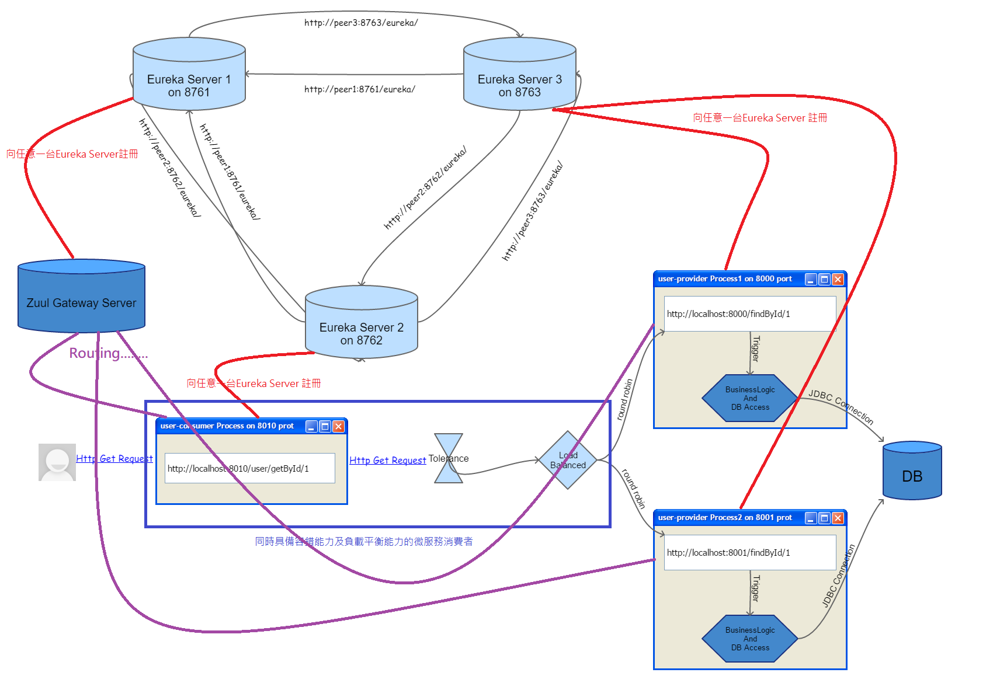
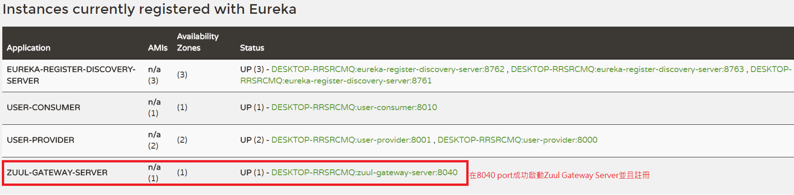
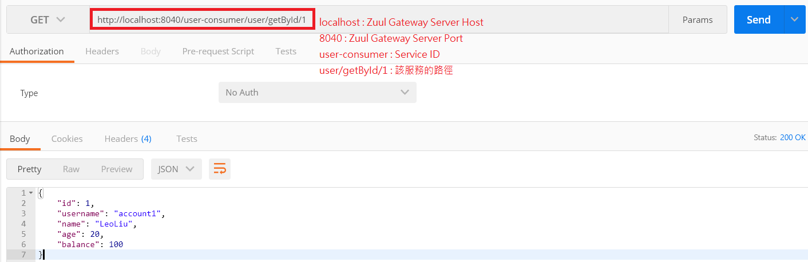
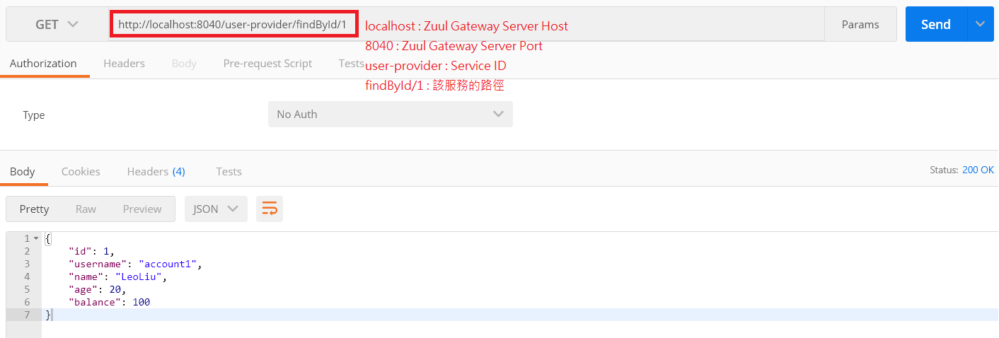

# Zuul Gateway Server(具備路由能力的伺服器)
* 註冊路由器：宣告自己是Zuul Gateway Server並且向Eureka Server提出註冊。
* 路由能力：只要Zuul Gateway Server成功向Eureka Server註冊，則此時它就可以路由此Eureka Server中的所有微服務(包括微服務消費者及微服務提供者)。
* 負載平衡：Zuul Gateway Server需具備和前述一樣的負載平衡能力。
* 容錯能力：Zuul Gateway Server需具備和前述一樣的容錯能力。

下圖為我們導入Zuul Gateway Server之後，整個微服務的架構：(本部份的變化就是多了一個Zull Gateway Server，而且把它註冊到Eureka Server中，它即可路由至此Eureka Server中所有的微服務)


這張圖的架構我們以***[Part2_Eureka_Server](../Part2_Eureka_Server/)***、***[Part3_User_consumer_feign](../Part3_User_consumer_feign/)***、***[Part2_User_provider](../Part2_User_provider/)***、以及本部份的***[Part4_Zuul_Gateway_Server](../Part4_Zuul_Gateway_Server/)***這四個project之程式碼來實作，程式碼中皆有豐富且詳細的註解。

啟動***[Part2_Eureka_Server](../Part2_Eureka_Server/)***、***[Part2_User_provider](../Part2_User_provider/)***、以及***[Part3_User_consumer_feign](../Part3_User_consumer_feign/)***這三個專案後，再啟動這個專案，之後隨便進入任何一台Eureka Server首頁(例如:http://localhost:8761) 。如下圖示：


由上圖可知，我們已經成功讓Zuul Gateway Server交由Eureka Server來註冊管理。

最後我們利用Google Chrome的postman plugin來測試Zuul Gateway Server，請求的格式為：
```http://Zuul_Host:Zuul_Port/微服務在Eureka Server上的service id/**``` ，則此時請求會被轉發到該service id對應的微服務，結果如下圖示：

1.這是向user-consumer發送的路由：


2.這是向user-provider發送的路由：


關於Zuul Gateway Server的load balanced及Tolerance之能力，與前述各部份類似，在此不再重複展示。

在微服務的分散式架構中，整個系統可能具有成千上百個微服務，而每一個微服務都有其屬性設定檔，這不論對開發、測試、佈署...等等，都是一個難題，因此我們需要一個集中管理以及可動態配置的統一管理微服務配置之伺服器。我們即將在下一個部份***[Part5_Config_Server](../Part5_Config_Server/)***做討論。