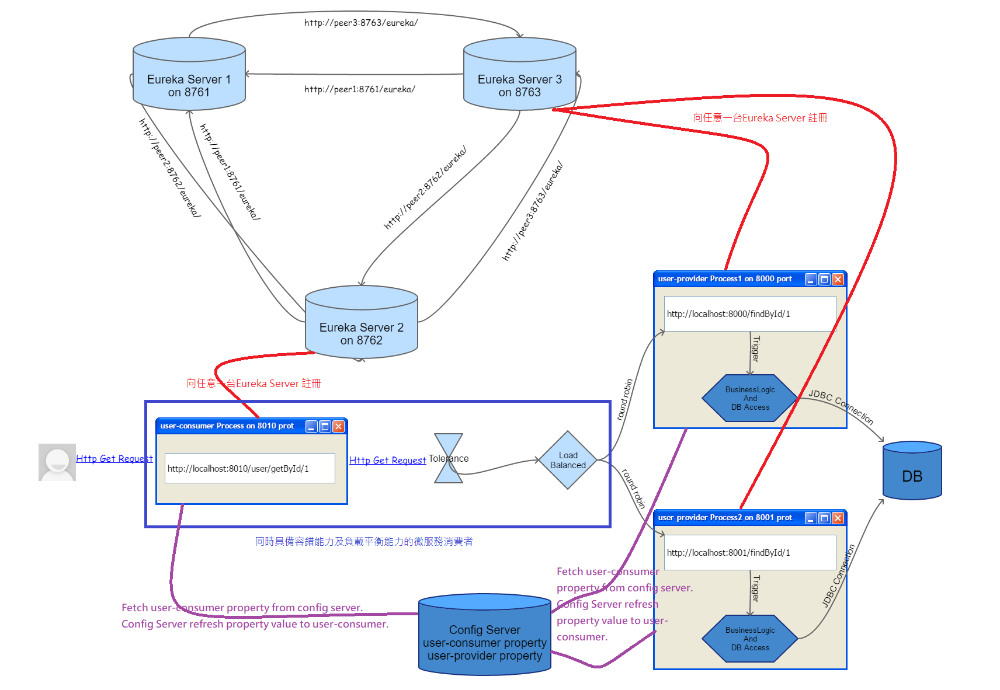
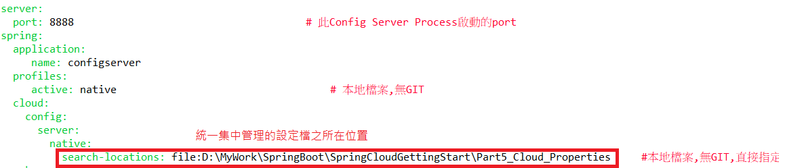
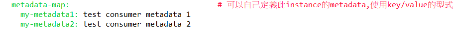
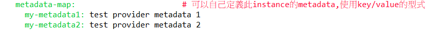
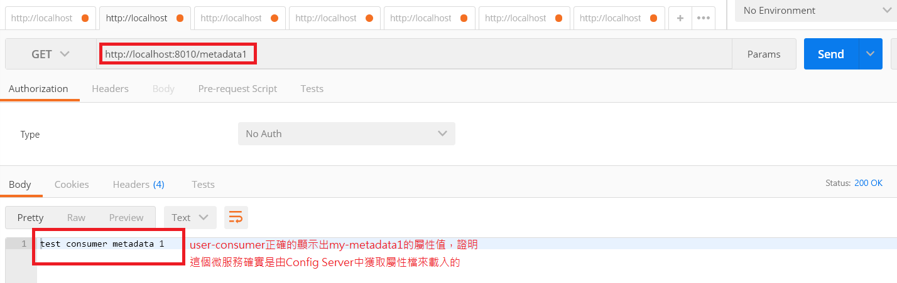
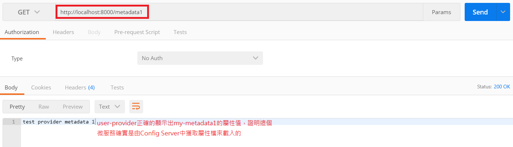
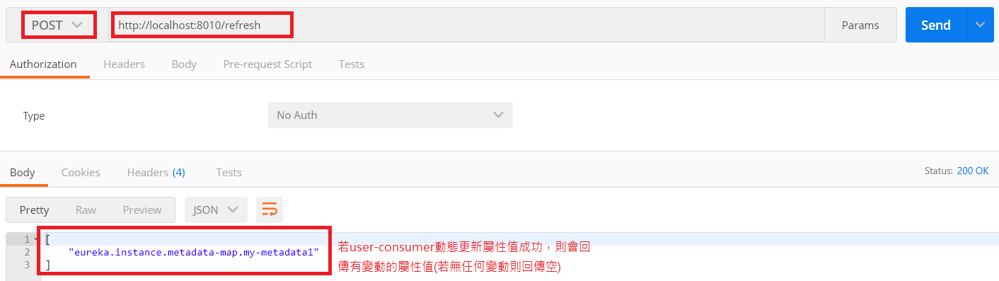
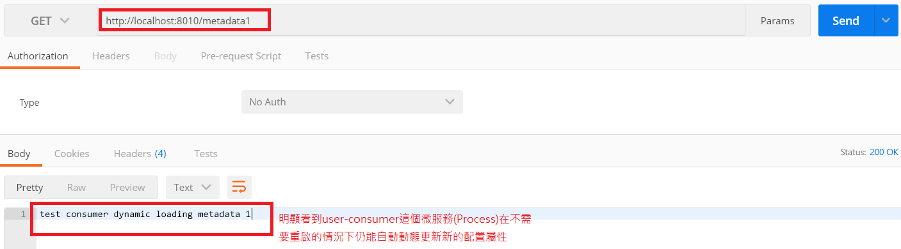

# Spring Cloud Config Server(統一集中管理屬性設定檔的伺服器)
* 統一集中管理：可以指定Folder來存放各微服務的屬性設定檔，此Folder可以是Remote git repository、Local git repository、或者Local file system。
* 動態配置能力：可以在各個微服務不用重啟Service(Process)的情況下，動態的套用已修改的屬性值。
* 自動刷新(Auto-Reload)：不需要經由人為重新載入，整個系統的各個微服務可以被自動的重新載入(這需要RabbitMQ，因此我們不實作它)。

下圖為我們導入Config Server之後，整個微服務的架構：


這張圖的架構我們以***[Part2_Eureka_Server](../Part2_Eureka_Server/)***、***[Part5_User_consumer](../Part5_User_consumer/)***、***[Part5_User_provider](../Part5_User_provider/)***、以及本部份的***[Part5_Config_Server](../Part5_Config_Server/)***這四個project之程式碼來實作，程式碼中皆有豐富且詳細的註解。

啟動***[Part2_Eureka_Server](../Part2_Eureka_Server/)***、***[Part5_User_provider](../Part5_User_provider/)***、以及***[Part5_User_consumer](../Part5_User_consumer/)***這三個專案後，再啟動這個專案 。我們利用***[Part5_Cloud_Properties](../Part5_Cloud_Properties/)***這個資料夾來存放user-consumer及user-provider的各項設定值。在config server中的application.ym檔中指定設定檔所在的資料夾如下圖示：


最後我們故意在Part5_Cloud_properties這個資料夾的user-consumer.yml及user-provider.yml檔中加上自定義的屬性值，然後refresh到user-consumer及user-provider這兩個微服務，看看動態配置屬性值是否成功，如下：

1.user-consumer中自定義屬性值如右圖：


2.user-provider中自定義屬性值如右圖：


3.在user-consumer微服務中撰寫一個Restful Service Controller，它很單純的只負責顯示出my-metadata1的屬性值，以測試屬性值是否可以被動態的刷新及載入：
```
@RestController
@RefreshScope
public class ConfigClientController {
	@Value("${eureka.instance.metadata-map.my-metadata1}")
    private String metadata1;
	
    @RequestMapping("/metadata1")
    String getMessage() {
        return this.metadata1;
    }
}
```
4.在user-provider微服務中撰寫一個Restful Service Controller，它很單純的只負責顯示出my-metadata1的屬性值，以測試屬性值是否可以被動態的刷新及載入：
```
@RestController
@RefreshScope
public class ConfigClientController {
	@Value("${eureka.instance.metadata-map.my-metadata1}")
    private String metadata1;
	
    @RequestMapping("/metadata1")
    String getMessage() {
        return this.metadata1;
    }
}
```
5.利用Google Chrome的postman plugin來測試Config Server的user-consumer.yml屬性檔是否被user-consumer所載入：


6.利用Google Chrome的postman plugin來測試Config Server的user-provider.yml屬性檔是否被user-provider所載入：


7.我們到Part5_Cloud_Properties的user-consumer.yml檔中改掉my-metadata1的屬性值為```test consumer dynamic loading metadata 1```，再利用Http Post方法來refresh新的屬性值到user-consumer微服務去：


8.再利用5之方法來測試user-consumer是否動態更新屬性值成功：


最後，可重複5~8步驟來對user-provider作測試，在此我不在詳細展示。

至此，我們已經建立了一個具加規模彈性及分散式架構的雲端微服務。