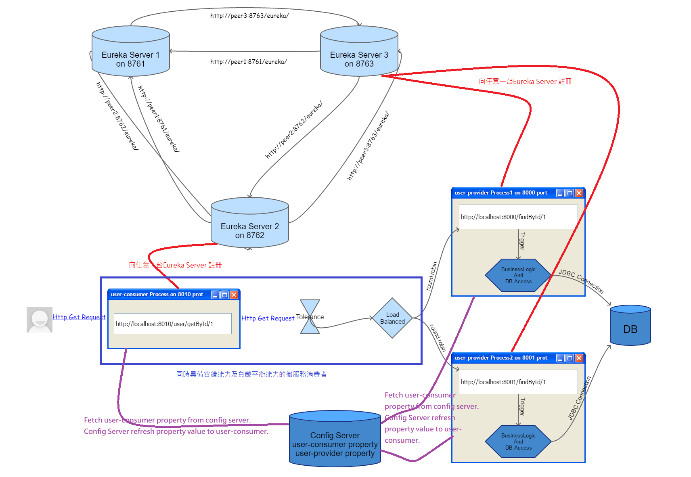

# user-consumer with config server(微服務消費者使用config server來載入屬性設定檔)
此部份的說明與***[Part5_Config_Server](../Part5_Config_Server/)***相同，user-consumer的改變只有把設定檔抽取出來，變成存放到config server中。

下圖為我們導入Config Server之後，整個微服務的架構：
